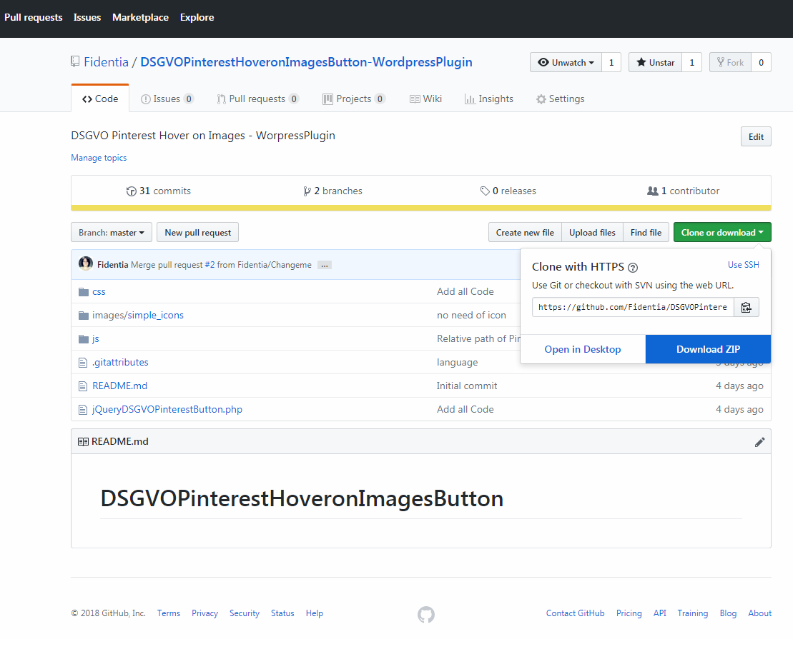
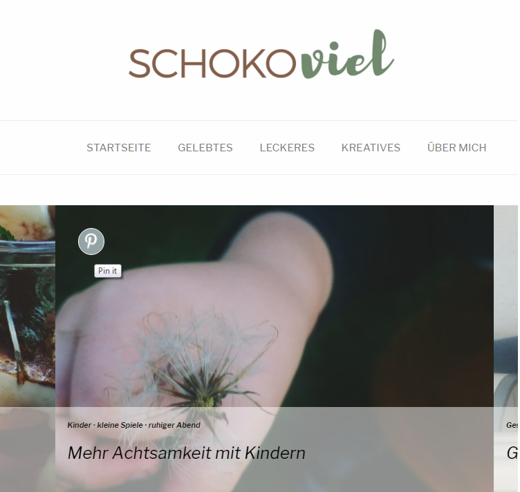

# DSGVOPinterestHoveronImagesButton Wordpress Plugin

> Add a simple Pinterest Hover on Images like the official Plugin but without tracking or loading any Javascript of Pinterest.

## Installation

Download your .zip and upload it in the Plugin backend of your Wordpress.

## Usage example

## Release History

* 0.0.1
    * Work in progress

## Meta

Distributed under the Creative Commons Zero v1.0 Universal license.

[https://github.com/Fidentia](https://github.com/Fidentia/)

## Donation
If this project help you reduce time to develop, you can give me a cup of coffee :) 

